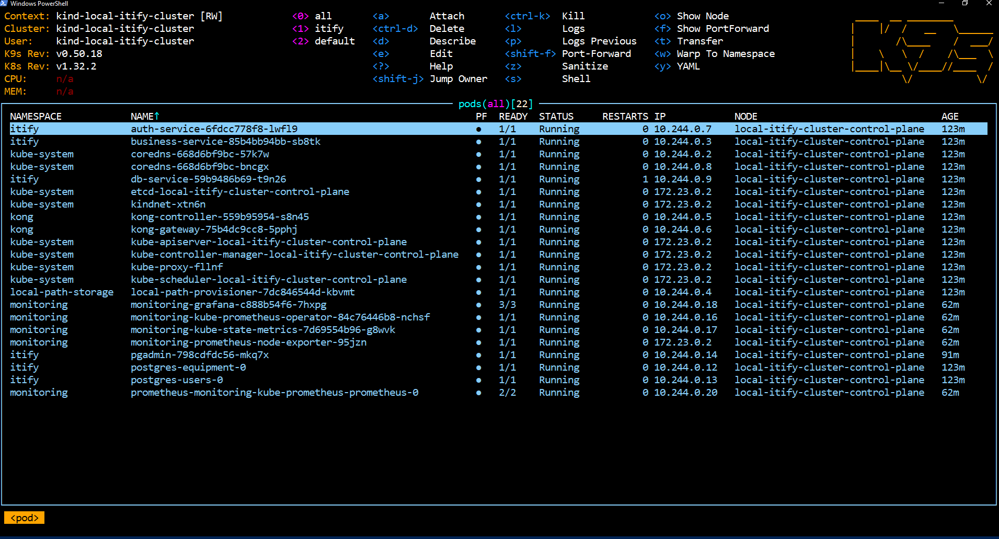
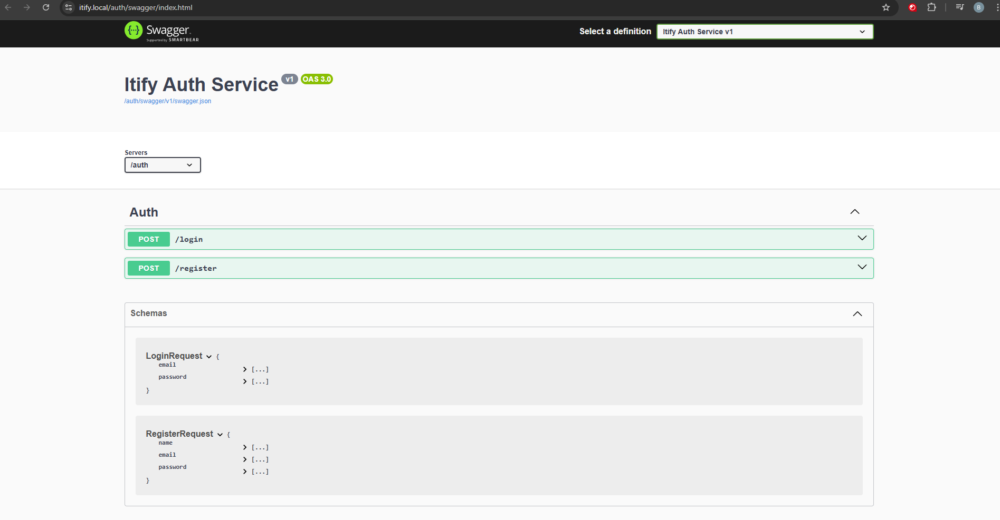
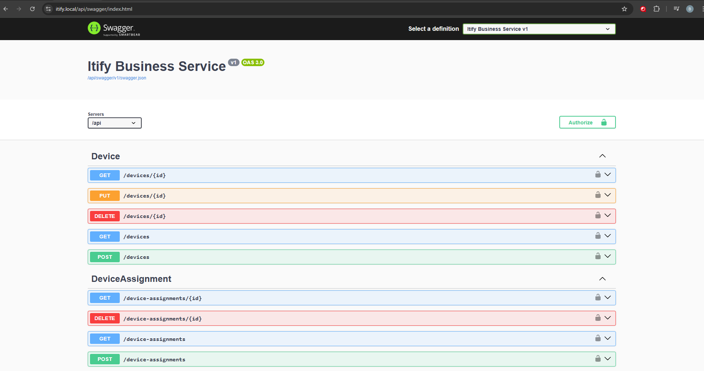
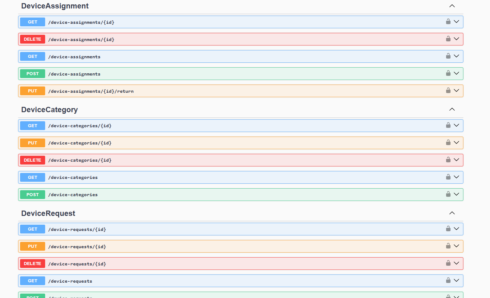

# Changelog - Itify

## [v0.3.0] - Observability and Database Management

### pgAdmin
pgAdmin 4 is created as a Kubernetes Deployment object in the `itify` namespace and exposed using Kong at `https://itify.local/pgadmin`.
It is directly connected to the two Postgres DB's using their internal Kubernetes DNS names: `postgres-users:5432` and `postgres-equipment:5432`.
The `SCRIPT_NAME=/pgadmin` environment variable is set in order for pgAdmin to generate correct relative URLs when served from a sub-path.
Network policies are added to allow pgAdmin to reach both PostgreSQL dbs while keeping them private from other pods.

### Prometheus
Prometheus is installed using the `kube-prometheus-stack` Helm chart in a separated `monitoring` namespace using `make install-monitoring`.
It is set up to extract metrics from all namespaces in the cluster, using the value from the values file: `serviceMonitorSelectorNilUsesHelmValues: false`.

### Grafana
Grafana is installed in addition to Prometheus as a part of the `kube-prometheus-stack` chart.
It is exposed using Kong at `https://itify.local/grafana` through an ExternalName Service in the `itify` namespace that resolves to `monitoring-grafana.monitoring.svc.cluster.local`.
The `serve_from_sub_path` and `root_url` settings in `grafana.ini` make sure that URL generation is done correctly when served from the `/grafana` sub-path.
Pre-built Kubernetes infrastructure dashboards are available out of the box, covering CPU usage, memory consumption and pod status per namespace.

## [v0.2.0] - Kubernetes deployment

Inside the `Deployment/` folder, there are the configuration charts for starting the whole application inside a Kind cluster.
The makefile has multiple rules:
- `make build-all` - builds the docker images for the 3 services
- `make push-all` - pushes the docker images to DockerHub
- `make cluster-up` - starts the Kind cluster from the config file at `Deployment/charts/kind-config.yaml`
- `make cluster-down` - deletes the Kind cluster
- `make deploy` - deploys the application to the cluster using the helm charts located at `Deployment/charts/`

### Dockerfiles
The 3 microservices have a multi step Dockerfile using `mcr.microsoft.com/dotnet/sdk:8.0` for the build stage and `mcr.microsoft.com/dotnet/aspnet:8.0` for the runtime stage, keeping only the runtime image in the end step.
A `.dockerignore` file ignores `bin/` and `obj/` from the build context to ensure no Windows-generated build files are being included in the image build process.
A `nuget.config` is placed in each service folder to ignore fallback package folders from local.

### Kind cluster
The Kind cluster configuration is inside `Deployment/kind-config.yaml` with 1 control-plane node running the image `kindest/node:v1.32.2`.
The node is labeled with `ingress-ready=true` inside `kubeadmConfigPatches` in order for the Kong Ingress Controller pod to be able to be scheduled on it.
Port mappings are defined to expose Kong's NodePorts to the host: `host port 80 to container port 30080` and `host port 443 to container port 30443`, making the cluster accessible at `itify.local` (defined in /etc/hosts) from the browser.

### Charts structure
- `Deployment/charts/services` - is responsible for applying the Deployment objects for the 3 microservices, pulled from their respective docker hub repositories.
The charts there also specify how the services are exposed to the cluster through ClusterIP services.
- `Deployment/charts/secrets` - contains the Kubernetes Secret objects for configuration such as the JWT signing key, PostgreSQL passwords and MailTrap credentials. All secrets use `stringData` to avoid double base64 encoding issues and are excluded from git inside `.gitignore`.
- `Deployment/charts/postgres` - contains the StatefulSet, PersistentVolumeClaim and ClusterIP Service objects for the two PostgreSQL Dbs, `postgres-users` and `postgres-equipment`. StatefulSet is used instead of Deployment to make sure the pod has stable identity and exact volume binding across restarts.
- `Deployment/charts/network-policies` - contains the NetworkPolicy objects that apply traffic isolation between services.
A deny all policy is applied to the `itify` namespace, barring all traffic and has explicit allow rules for: Kong -> auth-service and business-service, auth-service and business-service -> db-service, db-service and pgAdmin -> both PostgreSQL Dbs.
This represents the LAN isolation shown in the architecture diagram.
- `Deployment/charts/kong` - contains the Helm values used for setting up the Kong Ingress Controller and the Ingress route definitions.
Kong is the API Gateway and handles TLS termination using a certificate generated by local mkcert and trusted by the local browser.
Routes are configured as follows:
  - `/auth/*` - forwarded to auth-service with strip-path enabled (Kong eliminates `/auth` from request path before forwarding)
  - `/api/*` - forwarded to business-service with strip-path set to true
  - `/pgadmin/*` - forwarded to pgAdmin with strip-path disabled (pgAdmin handles the prefix via `SCRIPT_NAME`, essentially serving at /pgadmin)
  - `/grafana/*` - forwarded to Grafana using an ExternalName service pointing to the `monitoring` namespace

Examples for secrets charts are in their corresponding folders, with the `.example` extension.
 
Cluster in k9s after deployment:

## [v0.1.0] - Initial setup

This project is shared between the IDP and TWEB courses. I began working on the TWEB assignment first
which was based off of a code template provided at [this repo](https://gitlab.com/mobylabwebprogramming).

For the IDP assignment, I refactored the monolith backend into the microservices architecture, split between
`AuthService`, `BusinessService` and `DbService`, all of which are located in the root of the repo under their
respective folders. The frontend is not yet implemented.

Based on the app architecture above:
- The `AuthService` is responsible for handling the user registration and user login, coupled with the issuing
of JWT tokens for authentication and authorization (roles are Employee, Admin and ITEngineer). The service is built using ASP.NET Core and it is represented through a main
controller which serves the endpoints `/register` and `/login`. The schema is represented in its Swagger. The requests are forwarded to
the `DbService` for database operations, and the responses are returned to the client through the use of the `HttpClient` class.

- The `BusinessService` is responsible for handling the business logic of the application, which includes the management of the devices, assignments, users, usergroups and tickets.
It is built using ASP.NET Core and it is represented through a set of controllers: UserController, DeviceController, DeviceRequestController, UserGroupController, DeviceCategoryController, TicketController and DeviceAssignmentController.
This application is responsible for validating the JWT tokens issued by the `AuthService` and for forwarding the requests to the `DbService` for database operations, and the responses are returned to the client through the use of the `HttpClient` class.
The routes are exemplified in the Swagger documentation of the service.

- The `DbService` is responsible for handling the database operations of the application, which includes the management of the devices, assignments, users, usergroups and tickets. It is built using ASP.NET Core, along with .NET EF Core for migrations, seeds, specs and DB interaction
and it is represented through a set of controllers: UserDbController, DeviceDbController, DeviceRequestDbController, UserGroupDbController, DeviceCategoryDbController, TicketDbController and DeviceAssignmentDbController.
The routes are exemplified in the Swagger documentation of the service. The service is configured to connect to 2 databases: `postgres-users` and `postgres-equipment` which are responsible for user management and equipment management respectively.

Through MailKit (.NET library for sending emails), the `BusinessService` is also responsible for sending email notifications to users when their device requests are approved or rejected, and when their tickets are updated. Also email notifications are sent when a device is requested or a ticket is created to the Admins and ItEngineers.